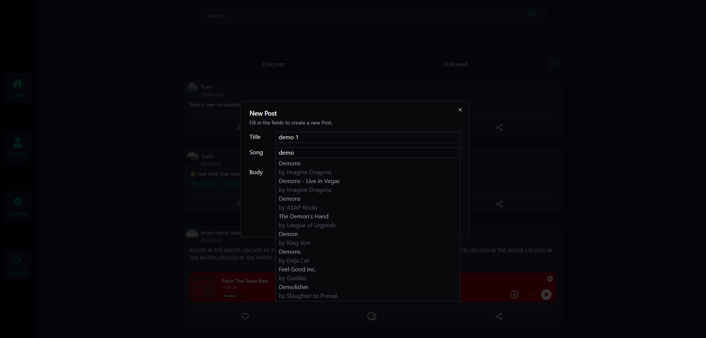

<h1 align="center">
  <br>
  
  <br>
  VibeCheck
  <br>
</h1>

<h4 align="center">A social media app where users express how they are feeling through a music sample and a short post.</h4>

<!-- Horizontal short Menu (w\ Links) -->
<p align="center">
  <a href="#key-features">Key Features</a> •
  <a href="#how-to-run">How To Run</a> •
  <a href="#gallery">Gallery</a> •
  <a href="#retrospective">Retrospective</a> •
  <a href="#credits">Credits</a>
</p>

<!-- Animated Screenshot-->


## Key Features

- Make posts and express your mood through songs
- Simple, slick interface
- Like posts and interact with comments
- Robust, tested app
- Infinite scroll dynamically loaded from Database for maximal performance
- Comprehensive search

## How To Run

### Docker Compose

To run the application this way, you'll need [Docker](https://www.docker.com/) installed on your computer and the `compose.yaml` file only.

```bash
# In the same folder as the compose.yaml file you downloaded is, run
$ docker compose up
```

> **Note**
> If you don't want to create a user, then feel free to use `johnny` with password `password`. Very secure, I know XD

### Dev mode

To clone and modify this application, you'll need [Git](https://git-scm.com), [Node.js](https://nodejs.org/en/download/) (which comes with [npm](http://npmjs.com)), [Docker](https://www.docker.com/) (for the MySQL database), and a Java VM, I recommend the [OpenJDK 21 build from Microsoft](https://learn.microsoft.com/en-us/java/openjdk/download). From your command line:

```bash
# Clone this repository
$ git clone https://github.com/N4fta/VibeCheck.git
```

For the frontend:

```bash
# Go into the frontend folder
$ cd VibeCheck/vibecheck_frontend

# Install dependencies
$ npm install

# Run the Vite app
$ npm run dev
```

For the database, the easiest way is to use the compose file in the backend folder:

```bash
# Go into the backend folder
$ cd VibeCheck/vibecheck_backend

# Start the MySQL service defined in the docker compose
$ docker compose up
```

Additionally, the container starts with an empty database, so the first time you start it, you should also populate it with some tables and data. This can be done by

```bash
# Execute the database-backup.sql script inside the container, this will create the tables needed as well as some users and example posts
$ docker exec -i vbc-mysql mysql -u root -pO3hlB8hciNHmFiLfgDeK vibecheck < .\db\database-backup.sql
```

> **Note**
> Passwords are hashed. If you don't want to create a user, then feel free to use `johnny` with password `password`. Very secure, I know XD

For the backend:

```bash
# Go into the backend folder
$ cd VibeCheck/vibecheck_backend

# Run the Gradle project
$ .\gradlew bootRun
```

> **Note**
> The backend should only be run after the MySQL database is reachable, or it will crash since it cannot connect to a database.

## Gallery

<div align=center>





</div>


## Retrospective

This is currently the project I am most proud of. I could see myself using it in my day-to-day life with some polish and a community, but it still lacks in some aspects.

This project was my first deep dive into a production pipeline. From testing, to GitLab pipelines, to SonarQube results to Docker and deployment. It was a semester full of code adjacent skills that I found extremely useful to learn. In addition to learning Java and JavaScript properly for the first time. And working with a real API for once. But this also revealed a big concern: security.

As the infinite universe expands, so does its attack surface.

In this specific project, security was not required, so, for example, my SQL DB password is in the Docker compose file. But if it was, I would need to hide it in Environment variables and copy these to all the machines in the pipeline. I can see this getting tedious very quickly with a big team. And that is just the start, Rest APIs are also vulnerable to attacks or misconfiguration, and my website also needs to be protected from threats like XSS. And ideally I should be careful of, and possibly review, all the packages I used.

That is something to consider for next time.

## Credits

This software uses the following open source packages:

- [Vite](https://vite.dev/)
- [React](https://react.dev/)
- [ShadCN](https://ui.shadcn.com/)
- [Cypress](https://www.cypress.io/)
- [Tailwind CSS](https://tailwindcss.com/)
- [Axios](https://www.npmjs.com/package/axios)

---

- [SpringBoot](https://spring.io/projects/spring-boot)
- [Mockito](https://site.mockito.org/)
- [SonarQube](https://www.sonarsource.com/products/sonarqube/)

---

- [Docker](https://www.docker.com/)
- [MySQL](https://www.mysql.com/)
- [GitLab](https://about.gitlab.com/)
- [Spotify API](https://developer.spotify.com/)

Created by myself at [Fontys](https://www.fontys.nl/).

### My Links

> [neo-dev.org](https://neo-dev.org) &nbsp;&middot;&nbsp;
> GitHub [@N4fta](https://github.com/N4fta)
